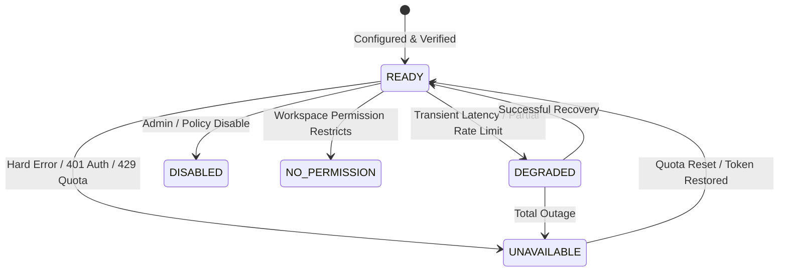

# Capability Registry Specification (CAPABILITY_REGISTRY_SPEC.md)

**Status**: SPECIFICATION & DOMAIN MODEL — PHASE 3B.1  
**Target Milestone**: Tool Gateway & Observation Router Registry  
**Purpose**: Central registry managing capability availability, health telemetry, relative cost tiers, and fallback chains.

---

## 1. Registry Purpose & State Machine

The **Capability Registry** acts as the central control plane for all external sensory and operational tools in the AI Marketing Department.

It provides:
1. **Dynamic Capability Discovery**: Agents request capabilities by name (e.g. `read_page`), not specific tools.
2. **Health & Rate-Limit Tracking**: Monitors backend error rates, response latencies, and quota exhaustion.
3. **Cost-Aware Routing**: Directs traffic to zero-cost local backends before incurring metered API or expensive LLM tokens.
4. **Resilient Fallback Chains**: Seamlessly switches to secondary backends when primary tools encounter errors.

### Capability State Machine



- **`READY`**: Backend is fully functional, credentials validated, response latencies within threshold.
- **`DEGRADED`**: High error rate (>20%) or latency spikes; router attempts secondary backends first.
- **`UNAVAILABLE`**: Missing credentials, broken upstream endpoint, or hard quota limit reached (e.g. 429).
- **`DISABLED`**: Administratively turned off via configuration.
- **`NO_PERMISSION`**: Blocked by the workspace permission engine (`MANUAL` mode or unauthorized product tier).

---

## 2. Generic Relative Cost Classes

Backends are tagged with generic relative execution cost classes (NOT monetary estimates):

| Cost Class | Description | Typical Latency | Examples |
|---|---|:---:|---|
| **`COST_0_LIGHT`** | In-memory / pure HTTP GET | < 100 ms | `trafilatura`, `beautifulsoup4`, `httpx` |
| **`COST_1_LOCAL_PARSE`** | Local CPU / Subprocess parsing | < 1.0 s | `yt-dlp` metadata/subtitles, RSS feeds |
| **`COST_2_BROWSER`** | Headless browser rendering | 1.5 – 3.5 s | `Playwright Chromium`, `Crawl4AI` |
| **`COST_3_AGENTIC_BROWSER`**| Autonomous multi-step LLM vision | 15.0 – 45.0 s | `Browser Use` (Vision/CDP) |
| **`COST_4_EXTERNAL_METERED`**| Cloud-hosted managed scrapers / paid APIs | 2.0 – 8.0 s | `Apify Platform Actors`, `Brave Search API` |

**Routing Invariant**: The registry always prioritizes backends in ascending order of cost class: `COST_0_LIGHT` $\rightarrow$ `COST_1_LOCAL_PARSE` $\rightarrow$ `COST_2_BROWSER` $\rightarrow$ `COST_3_AGENTIC_BROWSER` $\rightarrow$ `COST_4_EXTERNAL_METERED`.

---

## 3. Schema Definitions (Python / Pydantic Compatible)

```python
from datetime import datetime, timezone
from enum import Enum
from typing import Any, Dict, List, Optional
from schemas.base import BaseModel, Field


class CapabilityState(str, Enum):
    READY = "READY"
    DEGRADED = "DEGRADED"
    UNAVAILABLE = "UNAVAILABLE"
    DISABLED = "DISABLED"
    NO_PERMISSION = "NO_PERMISSION"


class CostClass(str, Enum):
    COST_0_LIGHT = "COST_0_LIGHT"
    COST_1_LOCAL_PARSE = "COST_1_LOCAL_PARSE"
    COST_2_BROWSER = "COST_2_BROWSER"
    COST_3_AGENTIC_BROWSER = "COST_3_AGENTIC_BROWSER"
    COST_4_EXTERNAL_METERED = "COST_4_EXTERNAL_METERED"


class BackendHealth(BaseModel):
    """Real-time operational health metrics for an individual tool backend."""
    backend_id: str = Field(..., description="Unique backend identifier, e.g. 'trafilatura_http'")
    state: CapabilityState = Field(default=CapabilityState.READY)
    cost_class: CostClass = Field(default=CostClass.COST_0_LIGHT)
    avg_latency_ms: float = Field(default=0.0)
    consecutive_failures: int = Field(default=0)
    last_success_at: Optional[datetime] = None
    last_error_at: Optional[datetime] = None
    last_error_message: Optional[str] = None
    rate_limit_reset_at: Optional[datetime] = None


class CapabilityRegistration(BaseModel):
    """Registration record defining a high-level capability and its prioritized backends."""
    capability_name: str = Field(..., description="e.g. 'read_page', 'youtube_metadata', 'read_transcript'")
    description: str
    primary_backend_id: str
    fallback_backend_ids: List[str] = Field(default_factory=list)
    state: CapabilityState = Field(default=CapabilityState.READY)
    required_permissions: List[str] = Field(default_factory=list)
    input_schema: str = Field(..., description="Typed input payload schema name")
    output_schema: str = Field(default="ObservationRecord")
    metadata: Dict[str, Any] = Field(default_factory=dict)
```
