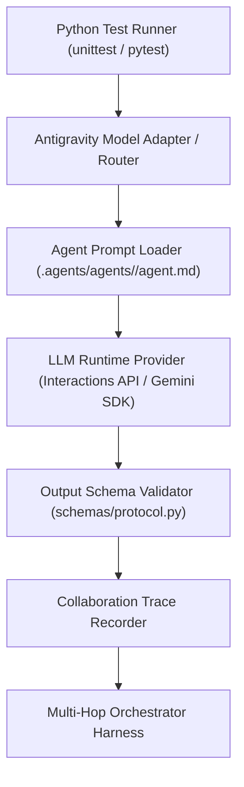

# Antigravity Multi-Agent Runtime & Live Collaboration Capability Audit (COLLABORATION_RUNTIME_GAP.md)

## 1. Executive Summary & Runtime Capability Status

- **Status**: `LIVE_COLLABORATION_EVAL = NOT_AVAILABLE`
- **Headless Test Suite Status**: `LIVE_MODEL_EVAL = NOT_RUN`
- **Contract & Protocol Status**: `STATIC_CONTRACT_TEST = PASS`

This document details the architectural analysis of the current Google Antigravity runtime environment with respect to programmatic, automated multi-agent collaboration execution.

---

## 2. Epistemic Distinction of Test Tiers

To preserve scientific and engineering integrity, we strictly distinguish four evaluation methodologies:

```text
┌─────────────────────────────────────────────────────────────────────────────┐
│                       EVALUATION METHODOLOGY TIERS                          │
├─────────────────────────────────────────────────────────────────────────────┤
│ 1. STATIC CONTRACT TEST: Verifies schemas, constraints, invariants,         │
│    and role definitions via static code analysis and schema validators.     │
│    Status: IMPLEMENTED & PASSING (111+ unit tests).                         │
│                                                                             │
│ 2. SIMULATED / FIXTURE TEST: Feeds hardcoded mock JSON outputs between      │
│    agents without model invocation.                                         │
│    Status: PROHIBITED (Per user instructions: Do not fake live agents).     │
│                                                                             │
│ 3. LIVE MODEL-IN-THE-LOOP TEST: Programmatically passes prompts to an LLM   │
│    and validates runtime generative adherence to protocols.                 │
│    Status: PENDING HEADLESS RUNTIME HARNESS (Phase 3+).                      │
│                                                                             │
│ 4. RUNTIME AGENT-TO-AGENT TEST: Autonomous background subagents invoking    │
│    each other dynamically via programmatic IPC message buses.               │
│    Status: BLOCKED BY ENVIRONMENT CONSTRAINTS (Documented below).           │
└─────────────────────────────────────────────────────────────────────────────┘
```

---

## 3. Runtime Capability Audit: Why Headless Multi-Agent Execution is Blocked

We audited the workspace and runtime execution environment across the 6 prerequisites for automated live agent collaboration:

| Requirement | Runtime Status | Technical Finding & Blocker |
|---|:---:|---|
| **1. Programmatic Agent Invocation from Shell** | ❌ Blocked | Custom agents (`cmo`, `intelligence`, `strategist`, `creative`, `performance`) are declared in `.agents/agents/<agent>/agent.md` for UI/tool subagent discovery. There is **no headless CLI tool or standalone daemon** (e.g. `antigravity run-agent --name cmo --input payload.json`) callable from standard `python -m unittest` scripts in the local Windows environment. |
| **2. Typed TaskEnvelope Transport** | ⚠️ Partial | Typed Python schemas (`TaskEnvelope`, `CollaborationTrace`, `ContradictionRecord`) are implemented in `schemas/protocol.py`, but there is no runtime serialization bus passing envelopes between independent OS processes. |
| **3. Programmatic Output Capture** | ❌ Blocked | Outside of the active interactive Antigravity agent session, subagent transcripts are stored in JSONL logs (`.system_generated/logs/`), which requires a live running agent turn to generate. |
| **4. Autonomous Multi-Hop Routing** | ❌ Blocked | Chaining Output Agent A $\rightarrow$ Input Agent B $\rightarrow$ Agent C currently requires interactive human or orchestrator turns; there is no automated headless pipe daemon. |
| **5. Trace Persistence** | ✅ Designed | `CollaborationTrace` schema is implemented and validated, ready to ingest logs once the runtime bus is connected. |
| **6. Behavioral Evaluation Harness** | ✅ Designed | 30 deterministic scenarios defined in `COLLABORATION_EVALUATION.md`. |

---

## 4. Why We Refuse to Fake Live Agent Results

Per the foundational principles of the AI Marketing Department:
1. **Zero Tolerance for Data Fabrication**: We do NOT write scripted Python mocks that return simulated LLM answers and label them "Live Model Pass".
2. **Epistemic Honesty**: Static unit tests validate contract compliance (`test_collaboration_definition.py`). Live behavioral evaluations remain marked **`NOT_TESTED`** until an actual headless model invocation harness is connected.

---

## 5. Architectural Roadmap to Unblock Live Model Evaluation

To transition `LIVE_MODEL_EVAL` from `NOT_RUN` to `LIVE_MODEL_EVAL = PASS`, the following runtime capabilities will be established in Phase 3 / Phase 6:



1. **Model Router Execution Bridge**: Connect `integrations/models/router.py` to live Google GenAI / Gemini API keys to allow programmatic model calls directly from test fixtures.
2. **Dynamic Agent Prompt Ingestion**: Read active `agent.md` system prompts into the test harness to run real-time prompt-response validation.
3. **Trace Validation Suite**: Run Scenarios 2, 8, 12, 17, and 20 through the live model harness and record verifiable traces.
