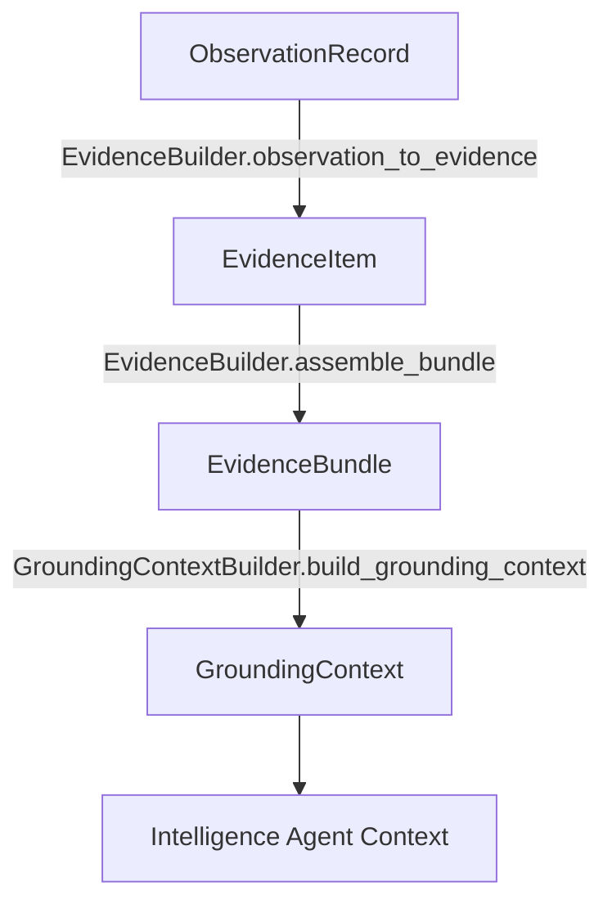

# Evidence Integration Specification (EVIDENCE_INTEGRATION_SPEC.md)

## 1. Purpose & Architectural Role
The Evidence Integration Layer forms the deterministic boundary between raw sensory observation tools (`ObservationRecord`) and analytical reasoning agents (specifically the `Intelligence` agent). It enforces:
- **Evidential Role Segregation**: Distinguishes `DISCOVERY` (search snippets) from `PRIMARY_CONTENT` (fetched page bodies), `PLATFORM_REPORTED_METRIC` (views, likes), and `USER_GENERATED_CONTENT` (forum posts/comments).
- **Product Isolation**: Ensures no evidence items belonging to different products are mixed into a single `EvidenceBundle`.
- **Epistemic Integrity**: Enforces `CONTENT_TRUST = UNTRUSTED_EXTERNAL` on external text, `SOURCE_CREDIBILITY = UNKNOWN` by default, and preserves unverified empirical claims.
- **Provenance & Freshness**: Tracks source provenance (`FIRST_PARTY_OFFICIAL_API`, `UNOFFICIAL_HTML_PARSE`, `THIRD_PARTY_SEARCH_INDEX`) and capability-specific freshness decay without arbitrary quality scores.

---

## 2. Core Entities

### 2.1 ContentRole
| ContentRole | Description | Example Capability |
|---|---|---|
| `DISCOVERY` | Search result hit lists, titles, and snippets. Useful for locating targets, not substantive claims. | `search_web` |
| `PRIMARY_CONTENT` | Full extracted page text, official documentation, product landing pages. | `read_page` |
| `PLATFORM_REPORTED_METRIC` | Third-party platform metrics (views, likes, subscriber counts). | `youtube_metadata` |
| `USER_GENERATED_CONTENT` | Forum posts, reviews, community comments. Reflects pseudonymous opinions. | `read_forum_thread`, `search_public_discussions` |
| `TRANSCRIPT` | Spoken audio/video timed speech segments. | `read_transcript` |
| `METADATA` | OpenGraph tags, JSON-LD, HTTP headers. | `analyze_url` |
| `REFERENCE` | Canonical URLs, citations, outbound links. | `read_page` |

### 2.2 SourceProvenance
- `FIRST_PARTY_OFFICIAL_API`: Official platform API (Hacker News Firebase, Wikipedia OpenSearch).
- `FIRST_PARTY_WEBSITE`: Direct HTTP DOM fetch from target domain.
- `THIRD_PARTY_SEARCH_INDEX`: Search indices (Hacker News Algolia, Google/Bing indices).
- `THIRD_PARTY_PLATFORM`: YouTube, Reddit public platforms.
- `SELF_HOSTED_META_SEARCH`: SearXNG self-hosted instances.
- `UNOFFICIAL_HTML_PARSE`: DuckDuckGo HTML scraping.
- `PUBLIC_USER_GENERATED_CONTENT`: Forum community threads.

---

## 3. Product Isolation Principle
Every `EvidenceItem` carries `product_id` and `brand_id`. `EvidenceBuilder.assemble_bundle` validates that all constituent items share the same `product_id`. Any accidental cross-product contamination raises `ProductIsolationViolationError`.
