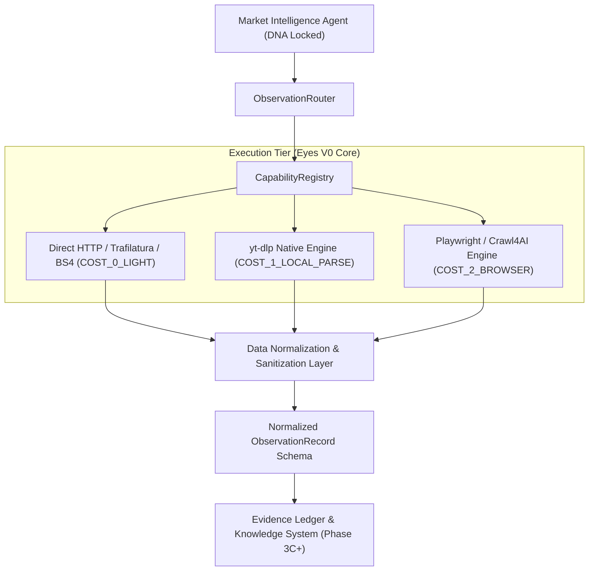

# Observation Layer V0 Architecture ("Eyes V0") (OBSERVATION_V0_ARCHITECTURE.md)

**Status**: SPECIFICATION & ARCHITECTURAL BLUEPRINT — PHASE 3B.1  
**Target Milestone**: Initial Empirical Observation for Market & Consumer Intelligence  
**Scope**: Focused, high-reliability initial vertical slice of 6 core observation capabilities

---

## 1. Architectural Mission of Eyes V0

The objective of **Eyes V0** is to give the AI Marketing Department (specifically the **Market & Consumer Intelligence Agent**) immediate, reliable, and real-world web observation capabilities without introducing monolithic dependency bloat.

### The 6 Core Capabilities of Eyes V0 Initial Slice

```text
┌────────────────────────────────────────────────────────────────────────┐
│                   EYES V0 INITIAL CAPABILITY SET                       │
├──────────────────────────────┬─────────────────────────────────────────┤
│ 1. search_web()              │ Fast web search across current pages    │
│ 2. read_page()               │ High-speed static & dynamic extraction  │
│ 3. analyze_url()             │ OpenGraph, metadata, and tech profiling │
│ 4. extract_structured_data() │ LLM-ready clean markdown and JSON       │
│ 5. youtube_metadata()        │ Video metadata, views, dates, channels  │
│ 6. read_transcript()         │ Automated speech-to-text / subtitles    │
└──────────────────────────────┴─────────────────────────────────────────┘
```
*(Broader social platform breadth e.g. TikTok/Instagram is deferred to Phase 4 after these 6 core primitives are proven).*

---

## 2. High-Level System Architecture



---

## 3. Normalized Observation Contract (`ObservationRecord`)

All raw payloads are transformed into a typed, backend-independent `ObservationRecord`:

```python
class ObservationRecord(BaseModel):
    """Normalized empirical observation deliverable passed to Intelligence."""
    observation_id: str = Field(..., description="Unique observation ID, e.g. OBS-20260816-001")
    capability: str = Field(..., description="Capability invoked, e.g. search_web, read_transcript")
    source_platform: str = Field(..., description="web | youtube | reddit | x")
    source_type: str = Field(..., description="article | video_transcript | video_metadata | search_results")
    source_url_or_id: str = Field(..., description="Target URL, video ID, or post identifier")
    collected_at: datetime = Field(default_factory=lambda: datetime.now(timezone.utc))
    observed_at: Optional[datetime] = Field(None, description="Original publication/upload timestamp")
    backend_used: str = Field(..., description="trafilatura | yt_dlp | playwright | bs4")
    collection_method: str = Field(..., description="DIRECT_HTTP | HEADLESS_DOM | CLI_EXTRACTOR")
    raw_reference: Optional[str] = Field(None, description="Filesystem path to raw cached payload")
    normalized_data: Dict[str, Any] = Field(..., description="Structured payload: text, title, metrics, metadata")
    evidence_class: EpistemicType = Field(default=EpistemicType.OBSERVATION)
    freshness_days: Optional[float] = Field(None, description="Days elapsed since original observation")
    confidence: str = Field(default="HIGH", description="LOW | MEDIUM | HIGH")
    limitations: List[str] = Field(default_factory=list, description="Known sampling gaps or scraper limits")
    product_id: str = Field(..., description="Associated workspace product isolation partition")
    brand_id: str = Field(..., description="Associated brand partition")
```

---

## 4. Phased Implementation Sequence

### Slice 1 (Phase 3C): Pure Python & Media Core (Zero browser binaries)
- `ToolGateway` core interfaces & `CapabilityRegistry`.
- `search_web()` via lightweight HTTP search.
- `read_page()` and `analyze_url()` via `httpx` + `trafilatura` + `bs4`.
- `youtube_metadata()` and `read_transcript()` via `yt-dlp`.
- Live validation with Market Intelligence Agent.

### Slice 2 (Phase 3D): Headless Browser Automation
- `playwright-python` integration for dynamic SPAs and JS-rendered pages.
- `extract_structured_data()` via Crawl4AI / Playwright DOM snapshots.

### Slice 3 (Phase 4): Social Listening & Cloud Scrapers
- Native Reddit / X discussion endpoints.
- Apify MCP client for managed cloud social actors.
