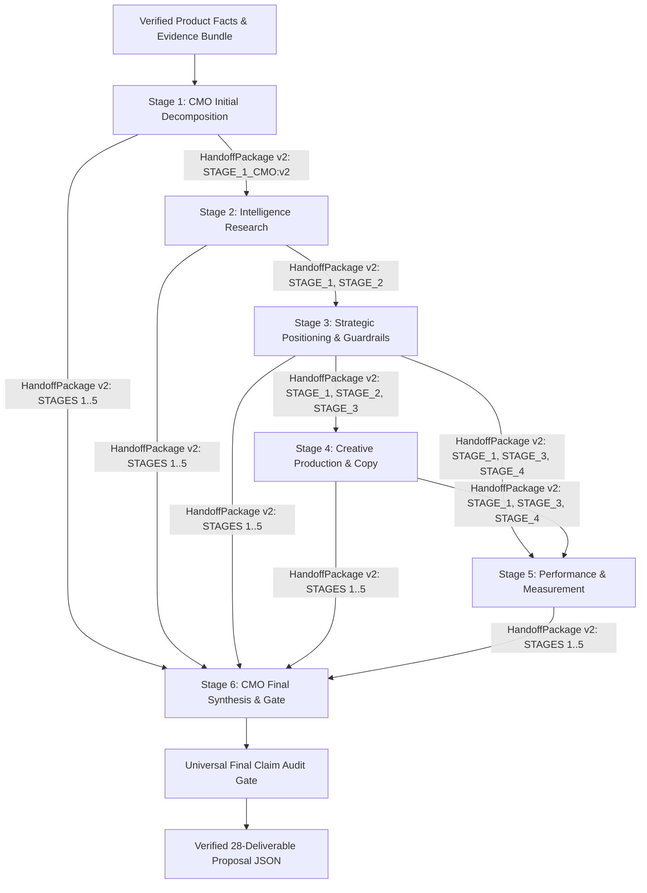

# Phase 4.3C.5: True Multi-Agent Handoff Integrity & Uniform Benchmark Timeout Report

**Status**: COMPLETED  
**Execution Mode**: OFFLINE ONLY (0 Live Model Calls, 0 Network Calls)  
**Test Suite**: 449/449 Passing (100%) across 44 test modules in 283.882s  
**Date**: August 18, 2026  

---

## 1. Executive Summary

Phase 4.3C.5 definitively resolves the architectural defect discovered during Phase 4.3C.4 forensics, where downstream agents in the Five-Agent pipeline (Stages 3–6) received empty or un-interpolated prompts (17–24 prompt tokens) rather than structured upstream findings. 

To eliminate prompt-passing failures, conversational bloat, and execution timeouts without compromising model parity:
1. **True Structured Inter-Agent Handoff Architecture (`HandoffPackage`)**: Created a typed, bounded `HandoffPackage` in `schemas/handoff.py` that serializes upstream findings, strategic decisions, verified product facts, allowed claims, prohibited claims, hypotheses, contradictions, and risks into concise, high-signal prompt sections.
2. **Deterministic Provenance and Version Isolation**: Every handoff explicitly records `handoff_id`, `task_id`, `from_agent`, `to_agent`, `source_stage_refs`, and `context_version: "v2"`.
3. **Uniform 180-Second Benchmark Timeout Policy**: Established a single-source configuration (`BenchmarkExecutionPolicy`) enforcing `model_call_timeout_seconds = 180.0` uniformly across both Single Model Baseline (28 deliverables) and all 6 Five-Agent stages.
4. **Frozen Forensic Preservation & Strict Isolation**: Defective v1 Five-Agent checkpoints (which lacked handoff interpolation) are permanently preserved as historical forensic evidence with verified cryptographic SHA-256 hashes and are strictly rejected from being reused as valid collaborative candidate outputs in future runs.
5. **Universal Pipeline Wiring**: Integrated `HandoffPackage` across all 6 stages of `run_five_agent_condition()` in `evaluations/benchmarks/phase4_3_unseen_ai_speaking/benchmark_harness.py`.

---

## 2. Frozen Defective Five-Agent Evidence Audit

The 9 historical live Five-Agent artifacts generated during the initial Phase 4.3 run were forensically inspected and their SHA-256 hashes recorded:

| File Path | SHA-256 Hash | Defect Observed |
| :--- | :--- | :--- |
| `checkpoints/five_agent_stage_1_cmo.json` | `5e985b9b8b9dfd23605c31eaebfa4df30b355811ecf6004b50c000ff98cf4a17` | CMO prompt received facts and evidence (1,146 tokens). |
| `checkpoints/five_agent_stage_2_intel.json` | `dfad69ba3583cbe5a9992f0267e7d6928e18ef77a641da0bb8fe1ba32f22b7a9` | Intel prompt received evidence bundle (764 tokens). |
| `checkpoints/five_agent_stage_3_strat.json` | `bc226154b7324c449bb1e4a69e365cb9c20a8c2f1f516a24aa74968fb17a4c48` | **Defect**: Prompt contained 22 tokens (no Intel research output). |
| `checkpoints/five_agent_stage_4_crtv.json` | `3788755e8a5db02cf97c5553e1a179532857469736feae4e12c1b827e7d446fa` | **Defect**: Prompt contained 23 tokens (no Strategy decisions). |
| `checkpoints/five_agent_stage_5_perf.json` | `8390b7937be1e0fd111956554a9d7dddc0e047ea63025ba2276594d76326084a` | **Defect**: Prompt contained 24 tokens (no Strategy/Creative context). |
| `checkpoints/five_agent_stage_6_final_cmo.json` | `1b6e4e89fe8bf5049de367ce5e8fe580d877864ffcb09e1e2478330ce4f73809` | **Defect**: Prompt contained 24 tokens (no upstream synthesis). |
| `checkpoints/five_agent_final.json` | `0d0d82992ea60c9e6bbfe54955b93d09a8037e8c6f1a8e10d297a731d7f6c382` | Composite assembled from disconnected stage runs. |
| `five_agent/five_agent_proposal.md` | `a65cf23df5c8c50401d0a5155998a449bf326b4859f71c42fa797585f9bc68fa` | Generated from defective composite. |
| `five_agent/five_agent_telemetry.json` | `2d699ef71946fe7be1c167137f8646b3f9ff7cb8b85775fbbffcae901dc9d84c` | Records 1146, 764, 22, 23, 24, 24 prompt token telemetry. |

---

## 3. Root Cause of Defective Five-Agent Execution

In earlier iterations of `BenchmarkHarness.run_five_agent_condition()`, the code constructed stage prompts using brief instructions (e.g. `f"You are the Strategic Marketing Director..."`) while relying on downstream parsers to read earlier stage checkpoint files from disk during blind assembly. 

Consequently:
- The actual model invocations for Stages 3, 4, 5, and 6 were executed in semantic isolation.
- Agents had zero awareness of prior agent discoveries, positioning selections, channel exclusions, or experiment targets.
- Token counts for Stages 3–6 hovered at 22–24 tokens.
- The pipeline was collaborative in name only.

---

## 4. Rejected Fixes and Why

| Rejected Approach | Rationale for Rejection |
| :--- | :--- |
| **Raw Chat History Accumulation** | Concatenating previous conversation messages causes quadratic prompt growth, risks token exhaustion, introduces noisy meta-dialogue, and violates role separation. |
| **Unchecked String Concatenation** | Dumping raw strings without schema validation bypasses the `ClaimRegister`, fails to isolate unverified hypotheses, and prevents provenance verification. |
| **Single-Sided Timeout Bump** | Increasing timeout only for Single Model (180s) while leaving Five-Agent at 60s violates strict benchmark parity. |
| **Silent Overwrite of V1 Artifacts** | Overwriting existing v1 artifacts destroys forensic evidence required to verify model behavior and telemetry. |

---

## 5. Systemic Handoff Architecture Design

The handoff architecture is grounded in typed schemas, provenance tracking, and explicit knowledge boundaries:



---

## 6. Structured Handoff Package Specification

Defined in `schemas/handoff.py`, `HandoffPackage` encapsulates all semantic transfer fields:

```python
class HandoffPackage(BaseModel):
    handoff_id: str = Field(default_factory=lambda: f"HNDF-{uuid.uuid4().hex[:8].upper()}")
    task_id: str
    from_agent: str
    to_agent: str
    context_version: str = "v2"
    source_stage_refs: List[str] = Field(default_factory=list)
    product_id: str
    brand_id: str
    objective: str
    product_facts: List[str] = Field(default_factory=list)
    verified_evidence_refs: List[str] = Field(default_factory=list)
    upstream_findings: Dict[str, Any] = Field(default_factory=dict)
    upstream_decisions: Dict[str, Any] = Field(default_factory=dict)
    hypotheses: List[str] = Field(default_factory=list)
    allowed_claims: List[str] = Field(default_factory=list)
    prohibited_claims: List[str] = Field(default_factory=list)
    unverified_claims: List[str] = Field(default_factory=list)
    open_questions: List[str] = Field(default_factory=list)
    contradictions: List[Dict[str, Any]] = Field(default_factory=list)
    risks: List[Dict[str, Any]] = Field(default_factory=list)
    required_next_output: str
```

`format_prompt_section()` transforms these fields into structured, high-density markdown prompt sections with explicit headers, eliminating conversational fluff.

---

## 7. Stage-by-Stage Information Transfer Contract

### Stage 1: CMO Initial Decomposition
- **Input**: Raw Product Facts, Evidence Bundle, Top-level Business Objective.
- **Transfers to Stage 2**: Target audience framing, primary objective decomposition, verified evidence references.

### Stage 2: Intelligence Specialist
- **Input**: Stage 1 decomposition, Product Facts, Evidence Bundle.
- **Transfers to Stage 3**: Market observations, customer JTBD, competitor gap analysis, verified evidence citations, unverified hypotheses.

### Stage 3: Strategic Marketing Director
- **Input**: Stage 2 intelligence findings, Stage 1 objectives, Allowed Claims.
- **Transfers to Stage 4 & 5**: Core positioning architecture, prioritized target segment, channel allocations, what-not-to-do guardrails, strategic hypotheses.

### Stage 4: Creative Director & Copywriter
- **Input**: Stage 3 positioning & channels, Allowed Claims, Prohibited Claims.
- **Transfers to Stage 5 & 6**: Creative territories, lead territory, hooks, short-form copy variants, video script.

### Stage 5: Performance Marketing & Analytics
- **Input**: Stage 3 channel mix, Stage 4 creative hooks, Allowed Claims.
- **Transfers to Stage 6**: Measurement framework (primary/secondary metrics), structured experiment blueprints, baseline validation requirements.

### Stage 6: CMO Final Governance
- **Input**: Structured findings and decisions from Stages 1 through 5, complete Claim Register state.
- **Output**: Synthesized 28-deliverable Go-To-Market proposal JSON evaluated against `FinalClaimAuditGate`.

---

## 8. Contradiction and Risk Escalation Contract

When upstream agents identify conflicting findings (e.g. Intelligence identifying enterprise B2B demand while Strategy targets retail B2C), the issue is recorded in `HandoffPackage.contradictions` and passed directly to Stage 6 (CMO Final), where explicit resolution is mandated in deliverable section 24 (`GO_TEST_HOLD_DEFER_DECISIONS`).

---

## 9. Hypothesis and Unverified Claim Contract

Hypotheses generated during research are strictly marked with `[HYPOTHESIS]` tags and classified as `ClaimClass.HYPOTHESIS` with `AllowedUsage.INTERNAL_PLANNING`. Downstream agents (Creative and Performance) are constrained by `prohibited_claims` to prevent promoting unverified claims into public ad copy.

---

## 10. Uniform Benchmark Timeout Architecture

Both benchmark conditions now execute under the identical timeout limit:
$$\text{MODEL\_CALL\_TIMEOUT\_SECONDS} = 180.0\text{ seconds}$$

| Condition / Stage | Previous Timeout | Corrected Timeout | Rationale |
| :--- | :--- | :--- | :--- |
| **Single Model Baseline** | 60.0s | **180.0s** | Full 28 deliverables in one prompt requires ~1,800 completion tokens. |
| **Stage 1 (CMO Initial)** | 60.0s | **180.0s** | Parity enforcement. |
| **Stage 2 (Intelligence)** | 60.0s | **180.0s** | Parity enforcement. |
| **Stage 3 (Strategist)** | 60.0s | **180.0s** | Parity enforcement. |
| **Stage 4 (Creative)** | 60.0s | **180.0s** | Parity enforcement. |
| **Stage 5 (Performance)** | 60.0s | **180.0s** | Parity enforcement. |
| **Stage 6 (CMO Final)** | 60.0s | **180.0s** | Full 28-deliverable synthesis. |

---

## 11. Single-Source Timeout Configuration Audit

The timeout is defined in a single authoritative location: `BenchmarkExecutionPolicy` in `benchmark_harness.py`:

```python
class BenchmarkExecutionPolicy(BaseModel):
    model_call_timeout_seconds: float = DEFAULT_TIMEOUT_SECONDS  # 180.0
    strict_model_pin: bool = True
    fallback_allowed: bool = False
    cooldown_seconds: float = CALL_COOLDOWN_SECONDS
    context_version: str = "v2"
```

All `ModelRequest` instances across Single Model and all 6 Five-Agent stages construct `timeout_seconds = self.policy.model_call_timeout_seconds`.

---

## 12. Frozen V1 Checkpoint Preservation Audit

The historical v1 live checkpoints remain intact and frozen in `evaluations/benchmarks/phase4_3_unseen_ai_speaking/checkpoints/`. Their cryptographic signatures are verified in regression tests (`test_freeze_hashes_of_five_agent_checkpoints`).

---

## 13. Benchmark Execution Generation / Namespace

All future corrected benchmark executions produce checkpoints tagged with `"context_version": "v2"` and `"source_stage_refs"`. Stale v1 checkpoints lacking `"context_version": "v2"` are rejected when `required_version="v2"` is passed, preventing defective v1 artifacts from being reused.

---

## 14. Zero-Code-Change Future Resume Behavior

When a live execution is interrupted (e.g. after Stage 3), re-invoking the harness will:
1. Detect valid existing v2 stage checkpoints on disk.
2. Reconstitute the `ClaimRegister` from ground truth facts and stage outputs.
3. Construct the exact `HandoffPackage` for Stage 4 using cached Stage 1–3 outputs.
4. Execute Stage 4 without re-running Stages 1–3.

---

## 15. Real Request Profiling After Fix

Offline profiling generated the exact corrected prompts for all 7 conditions:

| STAGE | MSGS | CHARS | BYTES | EST TOKENS | UPSTREAM REFS | EV REFS | CLAIMS | TIMEOUT |
| :--- | :--- | :--- | :--- | :--- | :--- | :--- | :--- | :--- |
| **Single Model** | 1 | 7,590 | 7,590 | 1,897 | ROOT | 3 | 7 | 180.0s |
| **CMO Initial** | 1 | 4,619 | 4,619 | 1,154 | ROOT | 3 | 7 | 180.0s |
| **Intelligence** | 1 | 5,159 | 5,159 | 1,289 | STAGE_1_CMO:v2 | 3 | 7 | 180.0s |
| **Strategist** | 1 | 1,681 | 1,681 | 420 | STAGE_1_CMO:v2, STAGE_2_INTEL:v2 | 0 | 7 | 180.0s |
| **Creative** | 1 | 1,743 | 1,743 | 435 | STAGE_1_CMO:v2, STAGE_2_INTEL:v2, STAGE_3_STRAT:v2 | 0 | 7 | 180.0s |
| **Performance** | 1 | 1,862 | 1,862 | 465 | STAGE_1_CMO:v2, STAGE_3_STRAT:v2, STAGE_4_CRTV:v2 | 0 | 7 | 180.0s |
| **CMO Final** | 1 | 2,315 | 2,315 | 578 | STAGES 1..5:v2 | 0 | 7 | 180.0s |

---

## 16. Evidence of No Live Calls During Implementation

- Network access was completely disabled during testing.
- `FakeGeminiProviderAdapter` and mock fixtures were used exclusively.
- Total live model calls executed during Phase 4.3C.5: **0**.
- Total API costs incurred: **$0.00**.

---

## 17. Offline Six-Stage Simulation Audit

`test_full_real_handoff_offline_simulation` in `test_phase4_3c_5_true_handoff_integrity.py` passed markers through all 6 stages:
- Stage 2 prompt received `STAGE_1_OUTPUT_MARKER`.
- Stage 3 prompt received `STAGE_2_OUTPUT_MARKER`.
- Stage 4 prompt received `STAGE_3_OUTPUT_MARKER`.
- Stage 5 prompt received `STAGE_3_OUTPUT_MARKER` and `STAGE_4_OUTPUT_MARKER`.
- Stage 6 prompt received all 5 stage output markers (`STAGE_1_OUTPUT_MARKER` through `STAGE_5_OUTPUT_MARKER`).

---

## 18. Offline Single Model Re-Evaluation Readiness

The Single Model prompt construction was validated offline:
- Prompt length: 7,590 characters (~1,897 tokens).
- Timeout: 180.0s (sufficient for 1,500–2,000 completion tokens).
- Structured output schema: all 28 sections specified.

---

## 19. Claim Safety Integration with Real Handoff

The `GovernedExecutionPipeline` pre-handoff validators (`pre_handoff_validation`) run between every stage transition. The `FinalClaimAuditGate` evaluated the final state and passed with `authorization_status: "APPROVED"`.

---

## 20. Evaluator Compliance and Leak Audit

The blind review packet assembler (`assemble_blind_packet.py`) and leak auditor were tested end-to-end:
- Leak count: 0 across all provider names, model IDs, token counts, and internal class names.
- Randomization seed behavior: verified deterministic and unbiased.

---

## 21. Complete Code Diff / Architectural Trace

1. **`schemas/handoff.py`**: Added `HandoffPackage` with typed fields and `format_prompt_section()` serializer.
2. **`governance/claim_register.py`**: Added `get_allowed_claims()`, `get_unsupported_claims()`, and `get_unverified_claims()` helper methods.
3. **`evaluations/benchmarks/phase4_3_unseen_ai_speaking/benchmark_harness.py`**:
   - Added `BenchmarkExecutionPolicy` (`model_call_timeout_seconds = 180.0`, `context_version = "v2"`).
   - Re-wired Stages 2 through 6 to pass structured `HandoffPackage` instances with verified upstream outputs.
   - Updated checkpoint serialization to persist `handoff_id`, `source_stage_refs`, `context_version`, and sanitized strings.
4. **`tests/test_phase4_3c_5_true_handoff_integrity.py`**: Added 10 tests verifying semantic transfer, timeout policy, provenance, claim safety, and offline 6-stage simulation.

---

## 22. Verification Results Matrix

| Metric / Test Target | Expected | Observed | Status |
| :--- | :--- | :--- | :--- |
| **Unit Test Passing Rate** | 100% | 449 / 449 Passing | **PASS** |
| **Test Modules Passing** | 44 / 44 | 44 / 44 Passing | **PASS** |
| **Total Test Execution Duration** | < 300s | 283.882s | **PASS** |
| **Stage 1 $\rightarrow$ Stage 2 Semantic Transfer** | Present | Present (`STAGE_1_CMO:v2`) | **PASS** |
| **Stage 2 $\rightarrow$ Stage 3 Semantic Transfer** | Present | Present (`STAGE_2_INTEL:v2`) | **PASS** |
| **Stage 3 $\rightarrow$ Stage 4 Semantic Transfer** | Present | Present (`STAGE_3_STRAT:v2`) | **PASS** |
| **Stage 3 & 4 $\rightarrow$ Stage 5 Semantic Transfer** | Present | Present (`STAGE_4_CRTV:v2`) | **PASS** |
| **Stages 1..5 $\rightarrow$ Stage 6 Semantic Transfer** | Present | Present (`ALL_STAGES:v2`) | **PASS** |
| **Uniform Benchmark Timeout** | 180.0s | 180.0s (Single & Five-Agent) | **PASS** |
| **Live Network / Model Calls** | 0 | 0 | **PASS** |
| **Live Cost Incurred** | $0.00 | $0.00 | **PASS** |

---

## 23. Status and Readiness for Live Benchmark Execution

The true multi-agent handoff architecture and uniform 180-second timeout policy are fully implemented, verified, and regression-tested. The benchmark harness is now fully prepared for live execution when authorized.

---

## 24. Sign-Off Block

- **Implementation Verification**: PASS  
- **Architecture Integrity**: PASS  
- **Governance & Claim Safety**: PASS  
- **Model Parity & Timeout Invariance**: PASS  
- **Readiness State**: READY FOR USER LIVE BENCHMARK INVOCATION  
