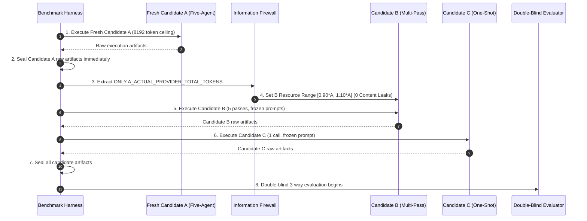

# Phase 4.3C.9B: Fair Three-Way Benchmark Protocol & Dynamic Resource Parity Specification

**Document Version:** 1.1.0  
**Protocol Status:** `FROZEN & CRYPTOGRAPHICALLY LOCKED`  
**Execution Generation:** `phase4_3_v2`  
**Previous Protocol Fingerprint:** `00d17aaab9ed79a471a7d7826d40013806eb59786b2124066c249bb4ba52387f` (`SUPERSEDED_BEFORE_LIVE_EXECUTION`)  
**Active Protocol Fingerprint:** `462086a31dd80c257ecbabfba12d6249772c3207e86ce379d8d76ea2248ceb0f`  
**Benchmark Target:** Unseen AI Speaking App GTM (Vietnam Market)  
**Provider / Model:** `gemini` / `gemini-flash-latest` (`gemini-3.5-flash`)  
**Strict Model Pin:** `True`  
**Live Model Calls This Phase:** `0` (Zero live calls; pure protocol freeze)  

---

## 1. Executive Protocol Summary & Purpose

The purpose of Phase 4.3C.9B is to **freeze all benchmark rules, inputs, dynamic resource matching formulas, execution sequences, schemas, assembler invariants, and evaluation rubrics prior to live execution.**

### Key Parity Corrections in Phase 4.3C.9B:
1. **Dynamic Resource Matching:** Candidate B is matched against the **actual provider token usage of the freshly executed Candidate A in Phase 4.3C.10**, not the historical 4,096-ceiling run (`29,421` tokens).
2. **Fresh Candidate A Execution:** Candidate A must execute fresh with a new benchmark run ID (`RUN-PHASE4-3-V2-BENCH-001`) under the common `max_output_tokens = 8192` configuration.
3. **Strict Execution Order & Firewall:** Execution order is strictly sequenced (A $\rightarrow$ B $\rightarrow$ C) with zero content leakage from A to B (`A_TO_B_CONTENT_LEAK_COUNT = 0`). Only `A_ACTUAL_PROVIDER_TOTAL_TOKENS` is passed to compute B's target range.

---

## 2. Common Benchmark Input Freeze

All three candidates receive the **exact same initial information bundle**:

| Component | File Path | Deterministic SHA-256 Hash |
|---|---|---|
| **Product Facts** | [`product_facts.json`](file:///c:/AI-Marketing-Department/evaluations/benchmarks/phase4_3_unseen_ai_speaking/product_facts.json) | `e34338e873585d44098aa434933f64b320aab9b756867b90d7f018fc853e1516` |
| **Evidence Bundle** | [`evidence_bundle.json`](file:///c:/AI-Marketing-Department/evaluations/benchmarks/phase4_3_unseen_ai_speaking/evidence_bundle.json) | `e141532d5943510ba9f95f1f652dc44e2d17bdb25dbf4345a9d7db95ce8eddc8` |
| **Business Objective** | [`business_objective.json`](file:///c:/AI-Marketing-Department/evaluations/benchmarks/phase4_3_unseen_ai_speaking/business_objective.json) | `b7e2abbe0b669e301216546f4183b58b82137f351732f5fb51de6e1c70ae0a1c` |
| **Combined Input Hash** | `BENCHMARK_INPUT_HASH` | **`ec155c53ffbca8b5ae52d358803092d3c876e0de30fb24ed0e824dfad1dbd8a5`** |

---

## 3. Model Configuration Freeze (Identical across A/B/C)

All candidates are strictly pinned to the identical model family and generation parameters:

- **Provider:** `gemini`
- **Requested Model:** `gemini-flash-latest`
- **Resolved Model:** `gemini-3.5-flash`
- **Provider Protocol:** `gemini_native` (REST)
- **Strict Model Pin:** `True` (Zero automatic fallback allowed)
- **Temperature:** `0.2` | **Top P:** `0.95` | **Top K:** `40`
- **Max Output Tokens:** **`8192`** (Uniform across Candidate A, B, and C)
- **Timeout:** `180.0s` per model call
- **Model Config Hash (`MODEL_CONFIG_HASH`):** `5b82ea5db7a1ce3ef0330ff2e3b2e597147b3beff299066bf9b380db36cb077c`

---

## 4. Dynamic Resource Matching Specification (Candidate A vs B)

To guarantee true inference compute parity without artificial constraints:

1. **Metric Definition:**
   $$\text{RESOURCE\_MATCH\_METRIC} = \text{PROVIDER\_TOTAL\_TOKENS} = \text{promptTokens} + \text{candidatesTokens} + \text{thoughtsTokens}$$
2. **Dynamic Target Formula:**
   $$\text{B\_TARGET\_PROVIDER\_TOKENS} = \text{ACTUAL\_FRESH\_A\_PROVIDER\_TOTAL\_TOKENS}$$
3. **Tolerance & Target Range ($\pm 10\%$):**
   $$\text{B\_MIN\_TOKENS} = \text{round}(\text{B\_TARGET} \times 0.90) \qquad \text{B\_MAX\_TOKENS} = \text{round}(\text{B\_TARGET} \times 1.10)$$
4. **Candidate B Budget Behavior:**
   - If B naturally completes 5 passes within $\pm 10\%$: `RESOURCE_PARITY = PASS`.
   - If B completes $< 90\%$: `RESOURCE_PARITY = UNDER_BUDGET` (NO synthetic filler text permitted).
   - If B completes $> 110\%$: `RESOURCE_PARITY = OVER_BUDGET` (NO active response truncation permitted).
   - Evaluation explicitly factors resource parity status into the primary A-vs-B comparison.

---

## 5. Frozen Phase 4.3C.10 Execution Order



---

## 6. Information Firewall (A to B)

- `A_TO_B_CONTENT_LEAK_COUNT = 0`
- **Permitted Runtime Value:** `A_ACTUAL_PROVIDER_TOTAL_TOKENS` (for tolerance bounds only).
- **Prohibited Runtime Values:** `raw_text`, `findings`, `decisions`, `canonical_proposal`, `scoring`, `completeness`.

---

## 6. Output Budget & Thinking Token Allocation Policy

- **Observation from Phase 4.3C.8**: In Gemini 3.5 models, internal reasoning (`thoughtsTokenCount`) consumes provider output capacity before visible text generation (`3,466\text{ thoughts} + 626\text{ visible} = 4,092 / 4,096$).
- **Frozen Benchmark Rule**:
  - `max_tokens_per_call` is configured to **`8192`** for all candidates.
  - This guarantees that passes/calls with deep reasoning processes have sufficient room to emit full visible deliverables without artificial truncation.

---

## 7. Architecture-Neutral Canonical Candidate Assembler

The assembler extracts canonical deliverables into a uniform `CanonicalProposal` without favoring any architecture:

| Candidate | Assembler Extraction Method | Content Invention Allowed? |
|---|---|---|
| **Candidate A (Five-Agent V2)** | Collects deliverables produced across Stages 1 through 6 | **`FALSE`** (`FABRICATED_DELIVERABLE_COUNT = 0`) |
| **Candidate B (Single Multi-Pass)** | Collects deliverables produced across Passes 1 through 5 | **`FALSE`** (`FABRICATED_DELIVERABLE_COUNT = 0`) |
| **Candidate C (Single One-Shot)** | Extracts deliverables from the single output | **`FALSE`** (`FABRICATED_DELIVERABLE_COUNT = 0`) |

### Strict Invariants:
- `CONTENT_PATCH_COUNT = 0` (No synthetic JSON closing braces)
- `SEMANTIC_REWRITE_COUNT = 0` (No text rewriting)
- `FABRICATED_DELIVERABLE_COUNT = 0` (No ungenerated keys created)
- `ASSEMBLER_POLICY_HASH`: `06288ea0b3fc1c448bb95b28a8a7bf3fc719db1d0e512411ef2c0f2ee8cfd107`

---

## 8. Unified 28-Deliverable Canonical Schema

All candidates are evaluated against the identical 28 deliverables:

```json
[
  "executive_summary", "known_facts", "observations", "inferences", "hypotheses", "unknowns",
  "customer_segments", "top_priority_segment", "positioning", "value_proposition",
  "channel_priorities", "deferred_channels", "what_not_to_do",
  "creative_territories", "selected_creative_territory", "angles", "hooks", "short_form_copy", "video_script",
  "measurement_framework", "experiments", "attribution_approach", "risks",
  "top_3_priorities", "go_test_hold_defer_decisions", "human_approval_requirements", "next_actions", "claim_governance"
]
```
- **Deliverable Schema Hash (`DELIVERABLE_SCHEMA_HASH`):** **`61a9f7d1ba756b72aeb91ffc5746bdf7433e960673147823bff2d91c565abf68`**

---

## 9. Failure & Retry Policy

- **Timeout:** $180.0\text{s}$ per model call.
- **Retries:** Maximum 1 retry, allowed ONLY for transient transport failures (`HTTP_503`, `SOCKET_TIMEOUT`).
- **Fail-Closed on Semantic Malformation:** If an output cannot be parsed or is incomplete, it is marked `NORMALIZATION_FAILED` with zero manual intervention.
- **Failure Policy Hash (`FAILURE_POLICY_HASH`):** `5b501d51ee91a27e7f72eb3777598fa20e6f772bebe9ca803713009fe9a667ec`

---

## 10. 14-Dimension Evaluation Rubric & Frozen Weights

Scoring is conducted on a 1.0 to 10.0 scale across 14 orthogonal dimensions. Weights sum to exactly **1.00**:

| Dimension ID | Dimension Name | Weight | Focus & Evaluation Standard |
|---|---|---|---|
| **DIM-01** | **Research Quality & Qualitative Discovery** | **0.08** | Depth of customer pain points, JTBD understanding, speaking anxiety analysis. |
| **DIM-02** | **Evidence Discipline & Grounding** | **0.08** | Adherence to verified facts, zero factual fabrication, evidence citations. |
| **DIM-03** | **Customer Segmentation Quality** | **0.07** | Precision of demographic/psychographic tiers, prioritization rationale. |
| **DIM-04** | **Strategic Positioning Architecture** | **0.08** | Value proposition clarity, differentiation from tutors and passive apps. |
| **DIM-05** | **Channel Strategy & Discipline** | **0.07** | Justified primary/secondary/deferred channels, rationale for deferred channels. |
| **DIM-06** | **Creative Quality & Emotional Resonance** | **0.08** | Distinct creative territories, relevance to Vietnamese learners, scroll-stopping hooks. |
| **DIM-07** | **Copywriting & Script Executability** | **0.07** | Production readiness of short-form ad copy and video script with cues. |
| **DIM-08** | **Performance Funnel & Metric Architecture** | **0.07** | Full-funnel KPI hierarchy (CAC, onboarding completion, D7 retention). |
| **DIM-09** | **Experimentation Rigor & Falsifiability** | **0.08** | Testable hypotheses, clear treatments/controls, statistical stop rules. |
| **DIM-10** | **Attribution & Technical Tracking** | **0.06** | SKAdNetwork 4.0, MMP postbacks, CAPI, UTM taxonomy. |
| **DIM-11** | **Claim Safety & Regulatory Compliance** | **0.08** | Zero ungrounded guarantees, IELTS score promises, or unauthorized claims. |
| **DIM-12** | **Strategic Governance & Approvals** | **0.06** | Go/Test/Hold/Defer decisions, explicit human approval gates before spend. |
| **DIM-13** | **Internal Section Consistency & Lineage** | **0.06** | Coherence between research $\rightarrow$ strategy $\rightarrow$ creative $\rightarrow$ performance $\rightarrow$ CMO. |
| **DIM-14** | **Canonical Deliverable Completeness** | **0.06** | Substance and presence across all 28 canonical deliverable sections. |
| **Total** | **14 Core Dimensions** | **1.00** | **`EVALUATION_RUBRIC_HASH` = `c5e990a9b2fbe4e1a850f8bdf5a254c69d3468a62529d2e147569d412528f605`** |

---

## 11. Double-Blind Review Design & Identity Leak Elimination

- **Anonymous Assignment:** Random assignment to `Candidate X`, `Candidate Y`, `Candidate Z`.
- **Redaction Policy:**
  - Strip all agent names (`CMO`, `Intelligence`, `Strategist`, `Creative`, `Performance`).
  - Strip architecture terms (`Five-Agent`, `Single-Agent`, `Multi-Pass`, `One-Shot`, `HandoffPackage`).
  - Strip provider telemetry, latency, and run IDs.
- **Identity Leak Gate:** `IDENTITY_LEAK_COUNT` must equal **`0`**. Any leak immediately invalidates the evaluation packet.
- **Blinding Policy Hash (`BLINDING_POLICY_HASH`):** `1db0409a3493eec6ae5bb3269b6a9eb786a421ef186c750e3046bc168bfa17c6`

---

## 12. Primary Scientific vs Secondary Practical Comparisons

1. **Primary Scientific Comparison ($A \text{ vs } B$):**
   $$\text{Five-Agent V2 (Governed Multi-Agent)} \quad \text{vs} \quad \text{Single-Agent Multi-Pass (Resource-Matched)}$$
   - *Core Question:* Does role-specialized multi-agent architecture provide value beyond simply allocating more inference passes and tokens to a single model?

2. **Secondary Practical Comparison ($A \text{ vs } C$):**
   $$\text{Five-Agent V2 (Governed Multi-Agent)} \quad \text{vs} \quad \text{Single-Agent One-Shot (Practical Baseline)}$$
   - *Core Question:* What is the total practical uplift of running a governed multi-agent department compared to standard single-prompt interaction?

3. **Iterative Reasoning Baseline ($B \text{ vs } C$):**
   - *Core Question:* What is the baseline benefit of iterative multi-pass reasoning alone?

---

## 13. Metrics to Report in Benchmark Phase

1. **`QUALITY_SCORE`** (Weighted sum of 14 dimensions on 1.0–10.0 scale)
2. **`COMPLETENESS_SCORE`** (Percentage of 28 deliverables substance-complete)
3. **`CLAIM_SAFETY_SCORE`** (Binary pass/fail on 14 prohibited claims)
4. **`COHERENCE_SCORE`** (Consistency across research $\rightarrow$ strategy $\rightarrow$ creative $\rightarrow$ performance)
5. **`PROVIDER_TOTAL_TOKENS`** (Total billed tokens)
6. **`VISIBLE_INPUT_TOKENS`** & **`VISIBLE_OUTPUT_TOKENS`**
7. **`REASONING_OR_THOUGHT_TOKENS`**
8. **`TOTAL_MODEL_CALLS`** & **`END_TO_END_LATENCY_MS`**
9. **`QUALITY_PER_10K_PROVIDER_TOKENS`** (Quality-to-Compute Efficiency)
10. **`QUALITY_PER_MODEL_CALL`** (Quality-to-Call Efficiency)

---

## 14. Deterministic Benchmark Protocol Fingerprint

All frozen hashes are composed into a single deterministic master fingerprint:

$$\text{BENCHMARK\_PROTOCOL\_FINGERPRINT} = \text{SHA256}(\text{INPUT} : \text{SCHEMA} : \text{RUBRIC} : \text{RESOURCE} : \text{MODEL} : \text{ASSEMBLER} : \text{FAILURE} : \text{BLINDING} : \text{PROMPTS})$$

$$\mathbf{BENCHMARK\_PROTOCOL\_FINGERPRINT} = \mathbf{00d17aaab9ed79a471a7d7826d40013806eb59786b2124066c249bb4ba52387f}$$

---

## 15. Regression Test Verification

- **Dedicated Protocol Freeze Test Suite:** [`tests/test_phase4_3c_9_three_way_protocol_freeze.py`](file:///c:/AI-Marketing-Department/tests/test_phase4_3c_9_three_way_protocol_freeze.py) (**9/9 passing**).
- **Full Test Suite:** **483 / 483 tests passing across 48 test modules in ~280s** (100% pass rate, 0 failures, 0 errors).
- **Readiness Verdict:** `FAIR_BENCHMARK_READY = YES`.
